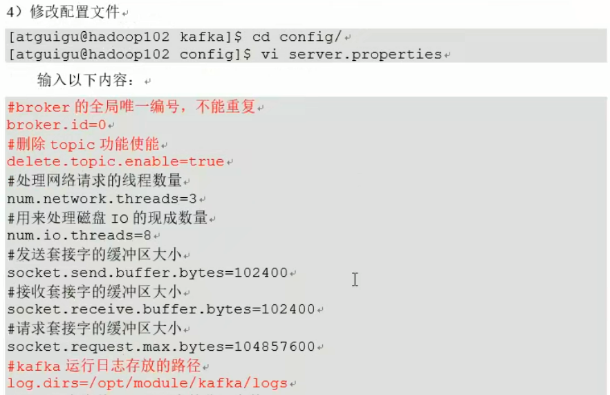
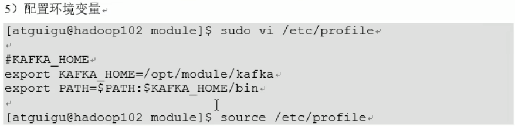
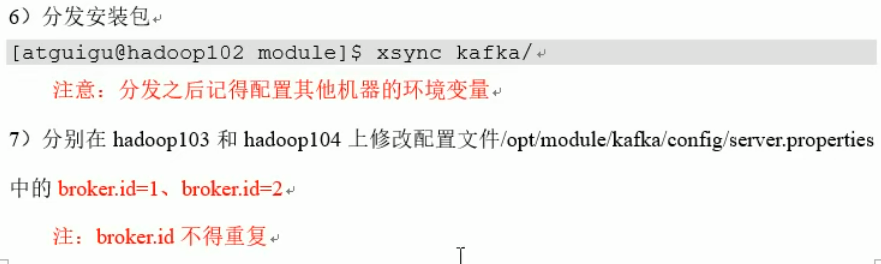

可选配置





命令行启动（挨个启动）


脚本启动&关闭

```shell
#!/bin/bash

case $1 in
"start"){
	for i in hadoo102 hadoo103 hadoo104
	do 
		echo "********** $i start **********"
		ssh $i "/opt/module/kafka/bin/kafka-server-start.sh -daemon /opt/module/kafka/config/server.properties"
	done
};;

"stop"){
	for i in hadoo102 hadoo103 hadoo104
	do 
		echo "********** $i stop **********"
		ssh $i "/opt/module/kafka/bin/kafka-server-stop.sh"
	done
};;
esac
```


